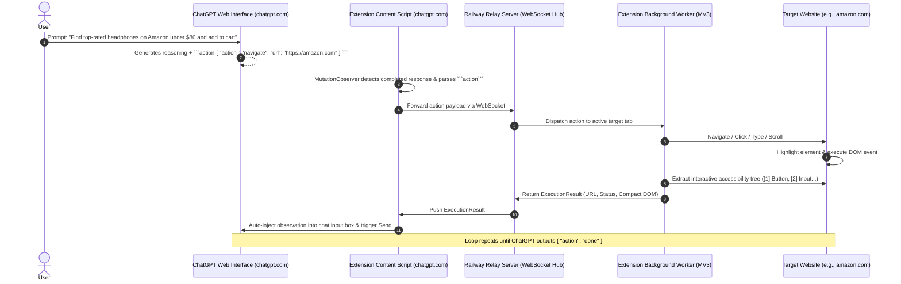

# Product Requirements Document (PRD)
## ChatGPT Browser Computer-Use Agent (Zero-Cost Architecture)

**Project Name:** `chatgpt-computer-use`  
**Version:** 1.0.0  
**Target Environment:** Local Chrome/Chromium Browser + Railway Cloud Relay  
**Budget / Cost Constraint:** $0.00 (No OpenAI API keys, No ChatGPT Plus subscription required, Free-tier Railway hosting)

---

## 1. Executive Summary

### 1.1 Overview
The **ChatGPT Browser Computer-Use Agent** is a system that grants autonomous web-browsing and computer-use capabilities to the free standard ChatGPT web interface (`chatgpt.com`). By combining a lightweight **Cloud Relay Server** (hosted on Railway) with a **Local Chrome Extension (Manifest V3)**, the system creates a closed-loop bridge. 

ChatGPT reads structured observations of the user's active browser session, decides on an action (e.g., click, type, navigate, scroll, extract data), outputs a structured JSON action block, and the local browser executes it instantly in real-time, feeding visual and text feedback back into the ChatGPT chat window.

### 1.2 Core Problem & Value Proposition
* **Problem:** OpenAI's native Computer Use or Operator capabilities are either paywalled, restricted to API users with high billing tiers, or run inside sandboxed cloud VMs that lack access to the user's local logins, cookies, extensions, and authentications.
* **Solution:** Enable client-side local browser automation directly driven by the free ChatGPT web interface, giving ChatGPT "hands and eyes" inside your existing local browser sessions with $0 running cost.

---

## 2. Goals & Non-Goals

### 2.1 Goals
- **$0 Total Cost:** No paid API keys or subscription requirements; fully operational with standard ChatGPT Free Tier.
- **Local Session Access:** Leverage existing authenticated sessions (e.g., Google, Amazon, GitHub, internal dashboards) without sharing passwords.
- **Real-Time Visual Feedback:** Render on-screen visual highlight boxes (bounding boxes/crosshairs) on the user's screen showing where the AI is clicking/typing.
- **Bi-directional Automation Loop:** Fully autonomous multi-step execution (e.g., "Search, filter, click item #3, add to cart, proceed to checkout") without requiring manual copy-pasting.
- **Safety First (Human-in-the-Loop):** Dedicated Hardware/UI Emergency Stop toggle, configurable confirmation prompts for destructive or financial actions (e.g., checkout, delete, transfer).
- **Zero Cloud Data Leakage:** Credentials and sensitive session cookies never leave the local machine; only parsed DOM representations and command metadata flow through the relay.

### 2.2 Non-Goals
- Full OS-level desktop automation (mouse movement outside the browser window to native Windows apps like File Explorer or Photoshop is out of scope for v1.0).
- Bypassing Cloudflare/Turnstile/reCAPTCHA challenges autonomously without user intervention.

---

## 3. System Architecture & Communication Flow

### 3.1 High-Level Architecture Diagram



---

## 4. Technical Stack & Dependencies

### 4.1 Cloud Relay Server (`/server`)
- **Runtime:** Node.js (v18+ LTS)
- **Framework:** Express.js (HTTP REST fallback & health monitoring)
- **Real-Time Protocol:** `ws` (High-performance WebSocket library)
- **Deployment Platform:** Railway (Free Starter Tier / Nixpacks builder)
- **Dependencies:**
  - `express`: `^4.19.2`
  - `ws`: `^8.17.0`
  - `dotenv`: `^16.4.5`
  - `cors`: `^2.8.5`
  - `uuid`: `^9.0.1`

### 4.2 Local Chrome Extension (`/extension`)
- **Format:** Chrome Extension Manifest V3
- **Languages:** Vanilla JavaScript (ES2022), HTML5, Modern CSS (Glassmorphism design tokens)
- **Browser APIs:**
  - `chrome.tabs`: Tab discovery, creation, navigation, and state query.
  - `chrome.scripting`: Dynamic script injection and DOM execution.
  - `chrome.runtime`: Inter-process messaging and background service worker lifecycle.
  - `chrome.storage.local`: Persistent settings (Server URL, Auth Token, Target Tab ID, Auto-run toggle).
  - `chrome.action`: Extension badge status (`ON`, `OFF`, `BUSY`) and popup dashboard.

---

## 5. Component Breakdown & Specifications

### 5.1 Cloud Relay Server (`/server`)
* **Role:** Acts as the persistent signaling and event routing hub between the local extension components.
* **Key Modules:**
  1. `server.js`: HTTP entrypoint, healthcheck route (`GET /health`), environment config.
  2. `wsManager.js`: Manages active WebSocket connections with client authentication (bearer token check).
  3. `sessionStore.js`: Keeps track of current task ID, execution history, and active command queues.

### 5.2 Extension Manifest (`extension/manifest.json`)
* **Permissions Required:**
  - `"tabs"`
  - `"activeTab"`
  - `"scripting"`
  - `"storage"`
* **Host Permissions:**
  - `https://chatgpt.com/*`
  - `https://*.chatgpt.com/*`
  - `<all_urls>` (Needed to execute computer-use commands across any target website).

### 5.3 ChatGPT Interceptor (`extension/content_chatgpt.js`)
* **Role:** Injected solely into `chatgpt.com`.
* **Functions:**
  - Observes the assistant's message container via `MutationObserver`.
  - Detects when the generation finishes (monitors the transition from `button[data-testid="stop-button"]` to the send button).
  - Extracts the raw markdown text and uses regex to match JSON code blocks tagged with ````action ... ````.
  - Formats incoming observations into standardized text:
    ```text
    [Browser Observation]
    Status: Success
    Current URL: https://www.amazon.com/dp/B0...
    Interactive Elements:
    [1] <button id="add-to-cart-button">Add to Cart</button>
    [2] <span class="price">$59.99</span>
    What is your next step?
    ```
  - Injects this payload into `div#prompt-textarea` or `textarea[data-id="root"]`, dispatches input events, and triggers a click on the Send button.

### 5.4 Target Action Executor (`extension/content_target.js` & `extension/action_runner.js`)
* **Role:** Injected into the website being controlled (e.g. Amazon, GitHub, YouTube).
* **Functions:**
  1. **Visual Overlay Engine:**
     - Creates a dedicated floating shadow DOM container (`#chatgpt-agent-overlay`).
     - Draws an animated pulse ring and red/blue bounding box over the exact target element before clicking or typing.
  2. **Human-like Interaction Simulator:**
     - `click`: Scrolls element into view with smooth behavior, triggers `mouseenter`, `mousedown`, `focus`, `mouseup`, and `click`.
     - `type`: Clears existing input (if specified), focuses, sets value, and dispatches `keydown`, `input`, `keyup`, and `change` events.
     - `scroll`: Scrolls by coordinate offset or scrolls to selector.
  3. **Accessibility Tree & Compact DOM Extractor:**
     - Crawls all visible, interactive elements (`a`, `button`, `input`, `select`, `textarea`, `[role="button"]`, `[onclick]`).
     - Filters out invisible/hidden elements (`display: none`, `visibility: hidden`, `opacity: 0`, 0x0 bounding rects).
     - Tags each element with a temporary index attribute (`data-agent-id="1"`, `data-agent-id="2"`).
     - Generates a concise, token-efficient DOM representation containing only essential attributes (`id`, `placeholder`, `aria-label`, `text`).

### 5.5 Extension Background Worker (`extension/background.js`)
* **Role:** Central message hub on the client machine.
* **Functions:**
  - Maintains persistent WebSocket connection to the Railway Relay server.
  - Automatically reconnects with exponential backoff if disconnected.
  - Routes action tasks to the selected target tab via `chrome.scripting.executeScript`.
  - Handles tab lifecycle events (re-injecting scripts if the target tab navigates to a new page).

### 5.6 Extension Popup Interface (`extension/popup.html`, `extension/popup.js`)
* **UI Features:**
  - **Connection Indicator:** Live badge (`🟢 Connected to Railway` / `🔴 Disconnected`).
  - **Target Tab Selector:** Dropdown listing all currently open tabs with an option to select or create a new target tab.
  - **Emergency Stop Button:** Big red button that immediately halts all active loops, clears command queues, and uninjects listeners.
  - **"Inject Agent Mode Prompt" Button:** Instantly pastes the system prompt into the active ChatGPT tab with one click.
  - **Live Action Log:** Scrollable terminal-style preview showing real-time execution steps.

---

## 6. Action Protocol Specification

All communications between ChatGPT, Relay, and the Extension adhere to the following JSON schema:

### 6.1 Action Request Schema (ChatGPT $\rightarrow$ Extension)

```json
{
  "$schema": "http://json-schema.org/draft-07/schema#",
  "type": "object",
  "required": ["action"],
  "properties": {
    "action": {
      "type": "string",
      "enum": ["navigate", "click", "type", "scroll", "wait", "extract_dom", "ask_user", "done"]
    },
    "url": { "type": "string", "description": "Required for navigate" },
    "element_id": { "type": "integer", "description": "Numeric tag [X] from DOM observation" },
    "selector": { "type": "string", "description": "CSS selector fallback" },
    "text": { "type": "string", "description": "Text to type into input" },
    "press_enter": { "type": "boolean", "default": false },
    "direction": { "type": "string", "enum": ["up", "down"], "default": "down" },
    "amount": { "type": "integer", "default": 500 },
    "seconds": { "type": "integer", "default": 2 },
    "question": { "type": "string", "description": "Question for user confirmation (ask_user)" },
    "summary": { "type": "string", "description": "Final task summary for done action" }
  }
}
```

### 6.2 Observation Response Schema (Extension $\rightarrow$ ChatGPT)

```json
{
  "status": "success" | "error" | "paused",
  "action_executed": "click",
  "current_url": "https://www.google.com/search?q=...",
  "page_title": "Google Search",
  "interactive_elements": [
    { "id": 1, "tag": "input", "type": "text", "name": "q", "value": "Google Flights" },
    { "id": 2, "tag": "button", "text": "Google Search" },
    { "id": 3, "tag": "a", "text": "Flights - Google", "href": "https://www.google.com/travel/flights" }
  ],
  "error_message": null
}
```

---

## 7. Safety, Security & Human-In-The-Loop Controls

1. **Local Credential Isolation:** The cloud relay only receives serialized JSON DOM indices and text labels. Cookies, session tokens, passwords, and raw headers are never transmitted.
2. **Emergency Killswitch:**
   - Pressing `Esc` three times in the browser instantly triggers emergency stop.
   - Extension popup contains a persistent "KILL AGENT" switch.
3. **Sensitive Domain & Action Safeguards:**
   - Any financial checkout button, "Place Order", "Delete Account", or payment form auto-triggers the `"ask_user"` state.
   - Extension pauses execution until the user manually confirms in chat or presses "Approve" in the popup.
4. **Token Authentication:** Railway server requires an `AGENT_SECRET_KEY` configured in extension settings to prevent unauthorized clients from connecting to the WebSocket bridge.

---

## 8. Directory & File Structure

```text
chatgpt-computer-use/
├── PRD.md                       # This Product Requirements Document
├── README.md                    # Quickstart and deployment guide
│
├── server/                      # Cloud Relay Server (Railway)
│   ├── package.json             # Server dependencies & scripts
│   ├── server.js                # Express & WebSocket entrypoint
│   ├── wsManager.js             # WebSocket connection & auth handler
│   ├── sessionStore.js          # In-memory session & queue state
│   ├── .env.example             # Environment variables template
│   └── railway.json             # Railway deployment configuration
│
├── extension/                   # Local Chrome Extension (Manifest V3)
│   ├── manifest.json            # Chrome extension configuration
│   ├── background.js            # Background service worker (WS client & script dispatcher)
│   ├── content_chatgpt.js       # chatgpt.com DOM observer & response injector
│   ├── content_target.js        # Target page action runner & visual bounding box renderer
│   ├── domExtractor.js          # Compact accessibility tree & DOM serializer
│   ├── popup/
│   │   ├── popup.html           # Extension UI Dashboard
│   │   ├── popup.css            # Modern dark-mode styling
│   │   └── popup.js             # Popup interactivity & tab selector
│   ├── icons/                   # Extension icons (16x16, 48x48, 128x128)
│   └── prompt_template.md       # Pre-engineered Agent System Prompt for ChatGPT
```

---

## 9. Step-by-Step Setup & Deployment Guide

### Phase 1: Deploy Relay Server to Railway ($0)
1. Fork or push the `/server` folder to a GitHub repository.
2. Log into [Railway.app](https://railway.app) (Free Tier).
3. Click **New Project** $\rightarrow$ **Deploy from GitHub repo**.
4. Set Environment Variables:
   - `PORT=3000`
   - `AGENT_SECRET_KEY=your_custom_secure_password_here`
5. Railway generates a public URL (e.g., `https://chatgpt-computer-use-production.up.railway.app`).

### Phase 2: Load Extension in Chrome
1. Open Chrome and navigate to `chrome://extensions/`.
2. Enable **Developer mode** (toggle in top-right corner).
3. Click **Load unpacked** and select the `/extension` directory.
4. Click the extension icon in the toolbar, open Settings, and enter:
   - **Relay Server URL:** `wss://chatgpt-computer-use-production.up.railway.app/ws`
   - **Secret Key:** `your_custom_secure_password_here`
5. Status changes to **Connected 🟢**.

### Phase 3: Run First Agent Session
1. Open a new tab and go to `https://chatgpt.com`.
2. Open the extension popup and click **"Start New Agent Session"** (this pastes the system prompt into ChatGPT).
3. Select your target tab from the popup dropdown.
4. Give ChatGPT your goal and watch the agent navigate, interact, and report back automatically!

---

## 10. Phased Implementation Roadmap

- [x] **Phase 1: Project Scaffolding & Server Build**
  - Create package structures, Express HTTP routes, WebSocket relay manager, and session store.
- [x] **Phase 2: Chrome Extension Core (MV3)**
  - Implement `manifest.json`, background service worker, WebSocket client with auto-reconnect.
- [x] **Phase 3: DOM Extractor & Visual Interaction Engine**
  - Implement `domExtractor.js` (indexing visible elements) and `content_target.js` (clicks, typing, highlight rings).
- [x] **Phase 4: ChatGPT DOM Interceptor & Injector**
  - Implement `content_chatgpt.js` (MutationObserver for response completion, markdown code block parser, automatic input injector).
- [x] **Phase 5: Popup UI & Safety Controls**
  - Implement modern glassmorphism popup with tab picker, live activity logs, and Emergency Killswitch.
- [x] **Phase 6: End-to-End Testing & Verification**
  - Test complex real-world workflows (e.g. search, pagination, multi-step forms) and refine token-efficient DOM pruning.
